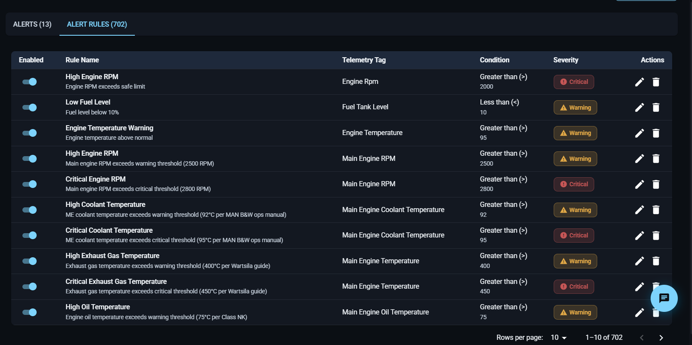
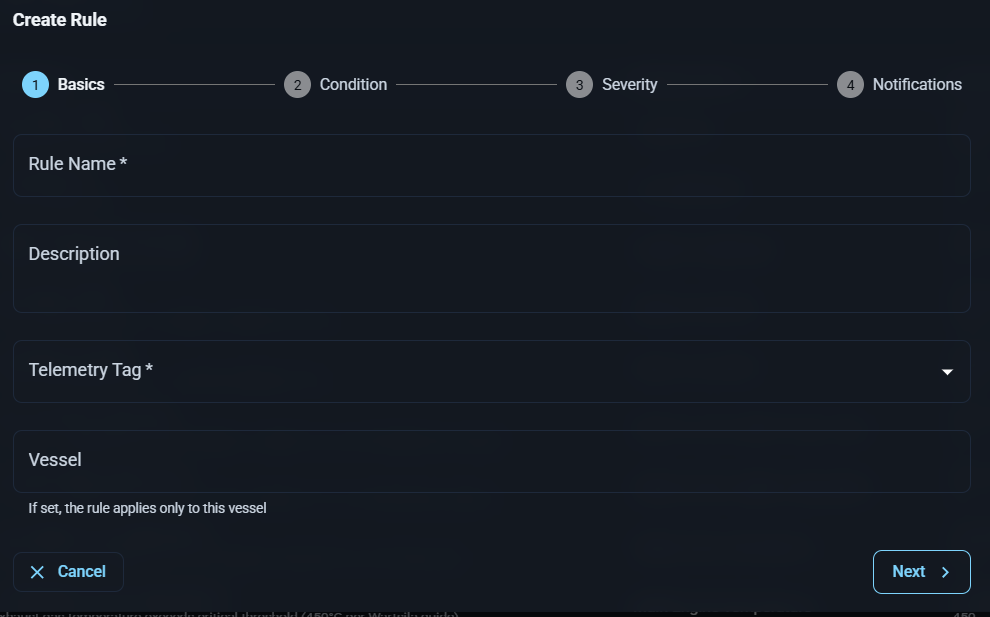
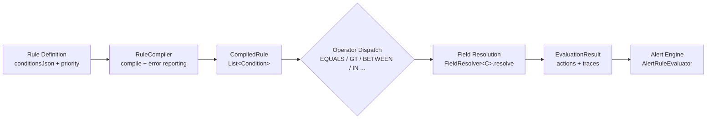

# ruleweave

A pure Kotlin library for evaluating JSON-defined conditions against arbitrary context objects, with a threshold-based alert engine.

## What Problem It Solves

You have domain objects (vessels, sensors, assets) and a set of configurable rules that should fire when certain field conditions are met. Instead of hardcoding `if/else` chains, ruleweave lets you store rules as JSON, compile them explicitly, evaluate at runtime against any context type, and get back structured results with priority, SLA deadlines, and per-condition traces.

## Features

- No Spring dependency - pure Kotlin library
- JSON condition lists with AND/OR chaining
- Short-circuit evaluation: AND stops on first false, OR stops on first true
- 10 operators: `EQUALS`, `NOT_EQUALS`, `GREATER_THAN`, `LESS_THAN`, `GREATER_THAN_OR_EQUALS`, `LESS_THAN_OR_EQUALS`, `CONTAINS`, `IN`, `NOT_IN`, `BETWEEN`
- Generic `FieldResolver<C>` interface - plug in any context type (map, entity, DTO)
- Template interpolation: `{{fieldName}}`, `{{vessel.id}}`, `{{sensor-status}}` in rule names and descriptions
- Priority inference from numeric rule weight → `CRITICAL / HIGH / MEDIUM / LOW / INFO`
- SLA deadlines auto-computed from priority (CRITICAL: 12 h, HIGH: 24 h, MEDIUM: 72 h)
- Explicit compile step via `RuleCompiler` with structured `RuleCompilationError` per invalid rule
- `EvaluationTrace` - per-rule and per-condition debug trace included in every `EvaluationResult`
- Threshold-based alert engine with severity levels and cooldown configuration

## Production Context

Extracted from a maritime SaaS platform where alert rules are configured through a web UI and evaluated in real time against vessel telemetry data.

<p align="center">
  
</p>

<p align="center">
  
</p>

## Compatibility

| Component  | Version     |
|------------|-------------|
| Kotlin     | 1.9+        |
| Java       | 21          |
| Jackson    | 2.17+       |

## Architecture



**Flow:**

1. `RuleCompiler.compile(rules)` deserializes `conditionsJson` → `List<Condition>` for each rule. Invalid rules produce `RuleCompilationError` entries rather than silently being dropped; callers can inspect or fail-fast on errors.
2. `RuleEvaluatorImpl` takes a `List<CompiledRule>` and evaluates on each `evaluate()` call.
3. Conditions are chained left-to-right using each condition's `logicalOperator` (`AND`/`OR`) with short-circuit semantics.
4. For each condition, `FieldResolver.resolve(field, context)` extracts the value from the context object.
5. The matching operator is dispatched; numeric comparisons use safe `toDoubleOrNull()` coercion - non-numeric values return `false` rather than throwing.
6. Matched rules produce `RuleActionResult` objects with interpolated titles, priority, and SLA deadlines computed from an injectable `Clock`.
7. Each evaluation produces a `List<RuleTrace>` in the result, one per active rule, with per-condition `ConditionTrace` entries for debugging.
8. `AlertRuleEvaluatorImpl` evaluates `AlertRule` thresholds and creates `ManagedAlert` records.

## Quick Start

```kotlin
// 1. Implement FieldResolver for your context type
val resolver = FieldResolver<Map<String, Any>> { field, ctx -> ctx[field] }

// 2. Define rules with JSON condition lists
val rule = Rule(
    name = "High Speed Alert for vessel {{vesselId}}",
    conditionsJson = """[
        {"field":"speed","operator":"GREATER_THAN","value":25},
        {"field":"zone","operator":"NOT_IN","value":"restricted,anchorage","logicalOperator":"AND"}
    ]""",
    actionsJson = "[]",
    priority = 15
)

// 3. Compile - check for errors before evaluating
val compiler = RuleCompiler(objectMapper)
val compilationResult = compiler.compile(listOf(rule))
if (compilationResult.hasErrors) {
    compilationResult.errors.forEach { error ->
        logger.error { "Rule '${error.ruleName}' failed: ${error.message}" }
    }
}

// 4. Evaluate
val conditionEvaluator = ConditionEvaluator(resolver)
val templateRenderer = TemplateRenderer(resolver)
val actionBuilder = ActionBuilder(templateRenderer)
val evaluator = RuleEvaluatorImpl(compilationResult.compiled, conditionEvaluator, actionBuilder)

val result = evaluator.evaluate(entityId, mapOf("speed" to 30.0, "zone" to "open-sea", "vesselId" to "V-42"))
// result.matchedRules == 1
// result.actions.first().title == "High Speed Alert for vessel V-42"
// result.actions.first().actionDeadline == Instant.now(clock) + 24h

// 5. Inspect traces
result.traces.forEach { ruleTrace ->
    println("Rule '${ruleTrace.ruleName}' matched=${ruleTrace.matched}")
    ruleTrace.conditionTraces.forEach { ct ->
        println("  field=${ct.field} op=${ct.operator} expected=${ct.expectedValue} actual=${ct.actualValue} matched=${ct.matched}")
    }
}
```

## Condition JSON Format

```json
[
  { "field": "speed",  "operator": "GREATER_THAN", "value": 20 },
  { "field": "status", "operator": "IN",           "value": "active,idle",  "logicalOperator": "AND" },
  { "field": "fuel",   "operator": "BETWEEN",      "value": [10, 30],       "logicalOperator": "OR"  }
]
```

- The first condition's `logicalOperator` is ignored.
- Conditions are evaluated left-to-right; `logicalOperator` on each subsequent condition combines it with the running result.
- `IN` / `NOT_IN` accept a comma-separated string or a JSON array.
- `BETWEEN` requires exactly two values: `[min, max]` inclusive.

## Template Interpolation

The pattern `{{key}}` supports plain field names, dot-notation, and hyphens:

| Template              | Example resolved value |
|-----------------------|------------------------|
| `{{vesselId}}`        | `V-42`                |
| `{{vessel.id}}`       | `V-42`                |
| `{{sensor-status}}`   | `OK`                  |
| `{{metadata.port.name}}` | `Rotterdam`        |

The `FieldResolver` receives the full key including dots and hyphens - resolution semantics are up to the caller.

## Operators Reference

| Operator                  | Types supported     | Notes                                         |
|---------------------------|---------------------|-----------------------------------------------|
| `EQUALS`                  | string, numeric     | Numeric comparison when both sides are numbers |
| `NOT_EQUALS`              | string, numeric     | Numeric comparison when both sides are numbers |
| `GREATER_THAN`            | numeric             | Returns false if either side is non-numeric    |
| `LESS_THAN`               | numeric             | Returns false if either side is non-numeric    |
| `GREATER_THAN_OR_EQUALS`  | numeric             | Returns false if either side is non-numeric    |
| `LESS_THAN_OR_EQUALS`     | numeric             | Returns false if either side is non-numeric    |
| `CONTAINS`                | string              | Substring check                               |
| `IN`                      | string              | Comma-separated or JSON array                  |
| `NOT_IN`                  | string              | Comma-separated or JSON array                  |
| `BETWEEN`                 | numeric             | Inclusive; returns false if non-numeric        |

## Alert Engine

`AlertRuleEvaluatorImpl` maps `AlertRule` condition types to threshold comparisons:

| Condition Type  | Behavior                                           |
|-----------------|----------------------------------------------------|
| `GREATER_THAN`  | `value > threshold`                               |
| `LESS_THAN`     | `value < threshold`                               |
| `EQUALS`        | `value == threshold`                              |
| `NOT_EQUALS`    | `value != threshold`                              |
| `OUT_OF_RANGE`  | `value < threshold OR value > conditionThresholdHigh` |
| `STALE`         | Placeholder: `value > threshold` (see Known Limitations) |
| `DELTA`         | Placeholder: `value > threshold` (see Known Limitations) |
| `RATE_OF_CHANGE`| Placeholder: `value > threshold` (see Known Limitations) |

## Known Limitations

- **Flat condition list, not a tree.** Conditions are evaluated as a flat list with AND/OR chaining. Nested grouping (e.g., `(A AND B) OR (C AND D)`) is not supported.
- **`actionsJson` is reserved.** The field exists on `Rule` but is not parsed or dispatched by the evaluator. It is stored for future action dispatch integration.
- **Placeholder alert types.** `STALE`, `DELTA`, and `RATE_OF_CHANGE` currently use simple threshold comparison as placeholders. Real staleness requires a last-update timestamp; real delta requires a previous value; real rate-of-change requires time-series data. None of these are currently plumbed through.
- **No persistence layer.** Rules and alert rules are passed as constructor arguments. Storage and loading are left to the caller.
- **No cooldown enforcement.** `AlertRule.cooldownSeconds` is stored but not enforced by `AlertRuleEvaluatorImpl`.

## Development Commands

```bash
./gradlew build          # compile + test
./gradlew test           # tests only
./gradlew clean build    # clean rebuild
```

## Release Status

`0.1.0-alpha` - API is unstable and subject to change.

## License

MIT - see [LICENSE](./LICENSE)
